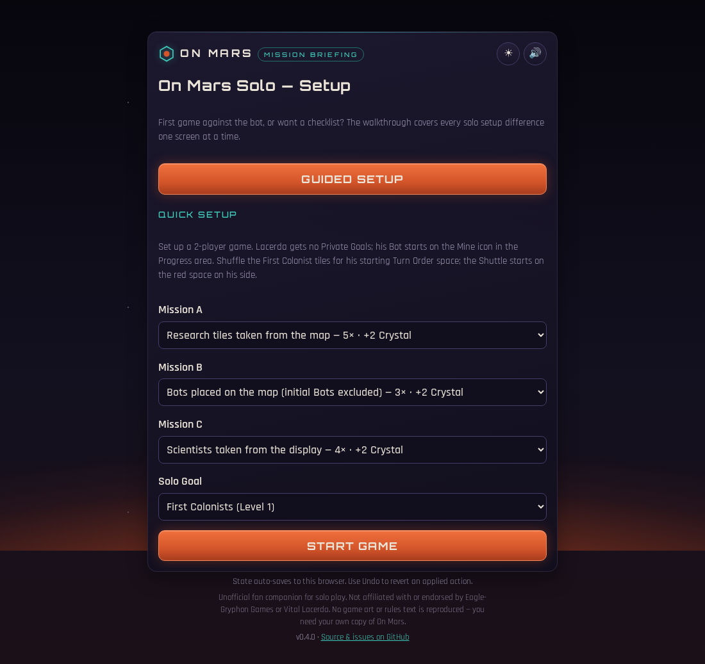
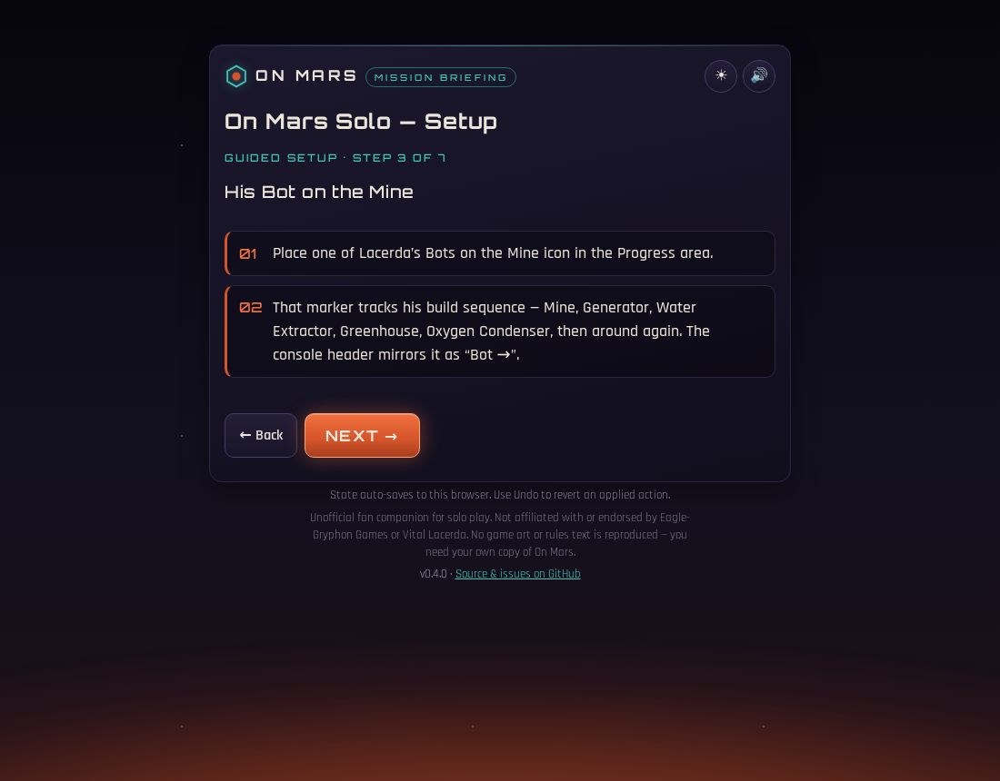
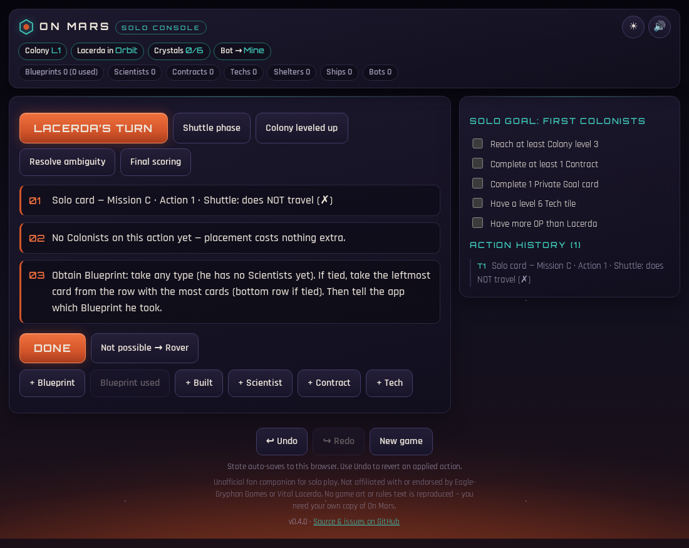
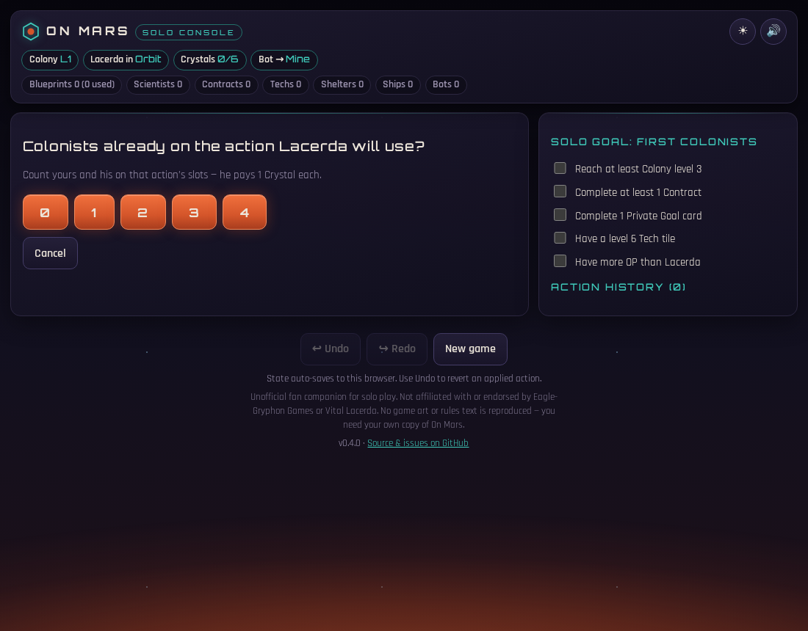
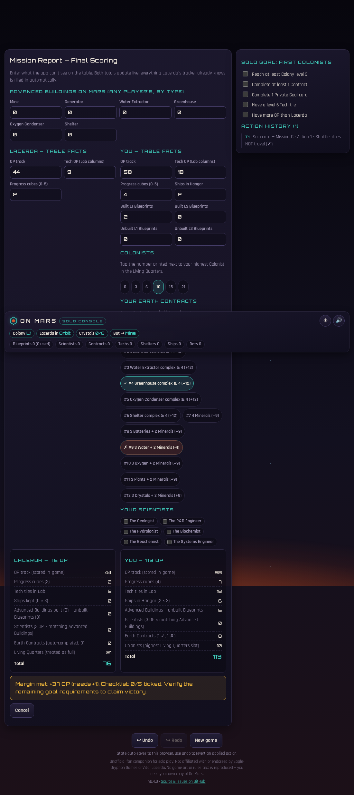
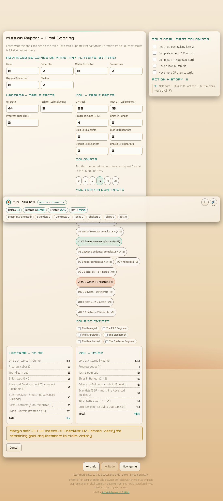
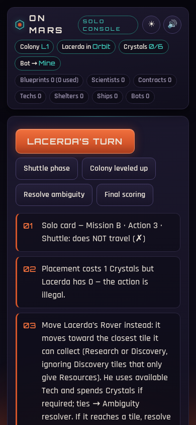

# On Mars Solo Companion

**Run the "Lacerda" bot without running yourself ragged.**

A free, offline-first web app that automates the solo opponent in *On Mars* (Vital Lacerda,
Eagle-Gryphon Games). The solo mode is famously exhausting: you play your own heavy euro
*and* hand-execute a rules-dense bot. This companion becomes the bot's brain — deck handling,
priority rules, tie-breaking, crystal accounting, mission tracking — so you only make the
physical moves on the table and focus on your own game.

**▶ Play it now: [solo.kdc.sh/on-mars](https://solo.kdc.sh/on-mars/)**
— installable as a PWA (Add to Home Screen) and fully offline at the table.

## What it does

- **Guided setup** — a step-by-step walkthrough of the solo setup differences (no Private
  Goals for Lacerda, his Bot on the Mine icon, First Colonist turn-order draw, Shuttle
  start), ending with your Mission slots and Solo Goal — dealt at random if you like. A
  one-screen quick setup remains for veterans.
- **Runs Lacerda's turns** — reveals a virtual solo card and walks you through his action
  with one imperative instruction at a time; every screen has a universal
  "Not possible → Rover" fallback for illegal moves.
- **Never forgets the second-pass rule** — from the second trip through the deck, Mission
  cubes move and Lacerda's Crystals are credited automatically (capped by his Depot).
- **Resolves ambiguities instantly** — the rulebook's "number the options, draw cards until
  one matches" procedure happens in one tap with the exact 5:4:3 odds.
- **Handles the Shuttle phase** — travel/stay from the last revealed card, random Turn Order
  space, destination steps.
- **Tracks Lacerda's empire** — Blueprints (with per-card data), Scientists, Contracts,
  Techs, Shelters, Ships, Bots, and his LSS Bot-icon loop.
- **Action history, undo/redo, autosave** — every event is logged, every tap reversible,
  and the game resumes after closing the browser.
- **Mission Report final scoring** — a guided end-game calculator: the app fills in
  everything it tracked for Lacerda (kept Ships, Blueprint ±OP, auto-completed Contracts,
  his always-full Living Quarters), you enter the table facts, and it renders both
  breakdowns live with a verdict against your Solo Goal's OP margin.
- **Night- and day-side themes** plus subtle synthesized console sound cues — both
  toggleable from the header.

## Screenshots

| Setup | Guided setup |
| --- | --- |
|  |  |

| Lacerda's turn | One-tap questions |
| --- | --- |
|  |  |

| Mission Report (final scoring) | Day-side theme |
| --- | --- |
|  |  |

| On a phone |
| --- |
|  |

## How it works

The app follows a **hybrid state model** (see [PRD.md](PRD.md)): it fully owns Lacerda's
*non-spatial* state and all randomness, while spatial decisions (Rover pathing, tile
placement) stay on the physical board — the app states the exact criteria and asks the
narrowest possible question when it needs table facts.

The rules data was catalogued from the physical game and the official reference book into
[docs/solo-deck.md](docs/solo-deck.md) and [docs/card-database.md](docs/card-database.md),
and encoded as typed modules with tests asserting the catalogued distributions.

## Development

```bash
cd app
npm install
npm run dev          # dev server
npx vitest run       # engine test suite
npm run test:e2e     # Playwright end-to-end tests (production build)
npm run screenshots  # regenerate README screenshots
npm run build        # typecheck + production build + service worker
```

The engine (`app/src/engine/`) is pure, immutable, and fully serializable — all randomness
flows through a seeded RNG stored in the game state, so games replay deterministically.
Every push to `main` runs the unit and end-to-end suites and deploys to GitHub Pages.

## Disclaimer

Unofficial fan companion for solo play. Not affiliated with or endorsed by Eagle-Gryphon
Games or Vital Lacerda. No game art or rules text is reproduced — you need your own copy of
*On Mars* to play.
